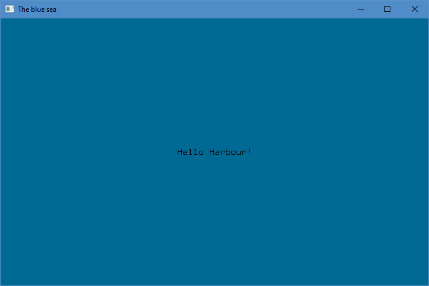

# hb-bluesea

Harbour module implementing bindings, playground with graphics, with the use of [GLFW](https://www.glfw.org/) and [Cairo](https://gitlab.freedesktop.org/cairo/cairo).

### Getting Started

For more info see [getting started](examples/README.md).

## Building

- Build static library:

   ```
   hbmk2 hbbluesea.hbp
   ```

- Build and run sample and test code:

   ```
   hbmk2 main.prg
   ./main
   ```

``` harbour
#include "hbbluesea.ch"

PROCEDURE Main()

   LOCAL w

   w := bs_CreateWindow( 720, 450, "The blue sea" )

   bs_FreeType( w, "../../font/9x18.ttf" )

   WHILE( ! bs_MainLoop( w ) .AND. ! bs_GetKey( w, KEY_ESCAPE ) )

      bs_Begin( w )

         bs_Background( w, 0x006994 )
         bs_Text( w, "Hello Harbour!", ( bs_WinWidth( w ) - 126 ) / 2, ( bs_WinHeight( w ) + 11 ) / 2, 0x000000 )

      bs_End( w )

      bs_WaitEvents()

   ENDDO

   bs_CloseWindow( w )

RETURN
```



